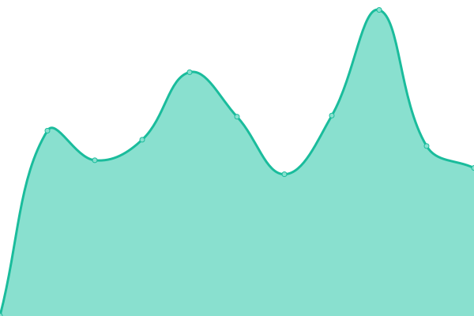

# [📈 Live Status](https://status.skalin.io): <!--live status--> **🟩 All systems operational**

This repository contains the open-source uptime monitor and status page for [Upptime](https://upptime.js.org), powered by [Upptime](https://github.com/upptime/upptime).

With [Upptime](https://upptime.js.org), you can get your own unlimited and free uptime monitor and status page, powered entirely by a GitHub repository. We use [Issues](https://github.com/upptime/upptime/issues) as incident reports, [Actions](https://github.com/SkalinCS/uptime/actions) as uptime monitors, and [Pages](https://status.skalin.io) for the status page.

<!--start: status pages-->
<!-- This summary is generated by Upptime (https://github.com/upptime/upptime) -->
<!-- Do not edit this manually, your changes will be overwritten -->
<!-- prettier-ignore -->
| URL | Status | History | Response Time | Uptime |
| --- | ------ | ------- | ------------- | ------ |
|  [UI](https://app.skalin.io/) | 🟩 Up | [ui.yml](https://github.com/SkalinCS/uptime/commits/HEAD/history/ui.yml) | 

 544ms
     
 | 

<a href="https://status.skalin.io/history/ui">100.00%</a>
    

|  [API](http://api.skalin.io/v1/healthcheck) | 🟩 Up | [api.yml](https://github.com/SkalinCS/uptime/commits/HEAD/history/api.yml) | 

 1069ms
     
 | 

<a href="https://status.skalin.io/history/api">100.00%</a>
    

|  [Tracker](https://collect.skalin.io/healthcheck) | 🟩 Up | [tracker.yml](https://github.com/SkalinCS/uptime/commits/HEAD/history/tracker.yml) | 

 720ms
     
 | 

<a href="https://status.skalin.io/history/tracker">100.00%</a>
    

|  [Webhooks](https://connector.skalin.io/webhook/aba337c4ga33baed?client_id=d0fd3591c03aff5c&test=1) | 🟩 Up | [webhooks.yml](https://github.com/SkalinCS/uptime/commits/HEAD/history/webhooks.yml) | 

 602ms
     
 | 

<a href="https://status.skalin.io/history/webhooks">100.00%</a>
    

|  [Authentification](https://auth.skalin.io/) | 🟩 Up | [authentification.yml](https://github.com/SkalinCS/uptime/commits/HEAD/history/authentification.yml) | 

 1238ms
     
 | 

<a href="https://status.skalin.io/history/authentification">99.69%</a>
    

|  [Mail](appmail.skalin.io) | 🟩 Up | [mail.yml](https://github.com/SkalinCS/uptime/commits/HEAD/history/mail.yml) | 

 98ms
     
 | 

<a href="https://status.skalin.io/history/mail">100.00%</a>
    

|  [Website](https://www.skalin.io/) | 🟩 Up | [website.yml](https://github.com/SkalinCS/uptime/commits/HEAD/history/website.yml) | 

 138ms
     
 | 

<a href="https://status.skalin.io/history/website">100.00%</a>
    

|  [Documentation](https://docs.skalin.io/) | 🟩 Up | [documentation.yml](https://github.com/SkalinCS/uptime/commits/HEAD/history/documentation.yml) | 

 624ms
     
 | 

<a href="https://status.skalin.io/history/documentation">100.00%</a>
    

<!--end: status pages-->

[**Visit our status website →**](https://status.skalin.io)

## 📄 License

- Powered by: [Upptime](https://github.com/upptime/upptime)
- Code: [MIT](./LICENSE) © [Upptime](https://upptime.js.org)
- Data in the `./history` directory: [Open Database License](https://opendatacommons.org/licenses/odbl/1-0/)
